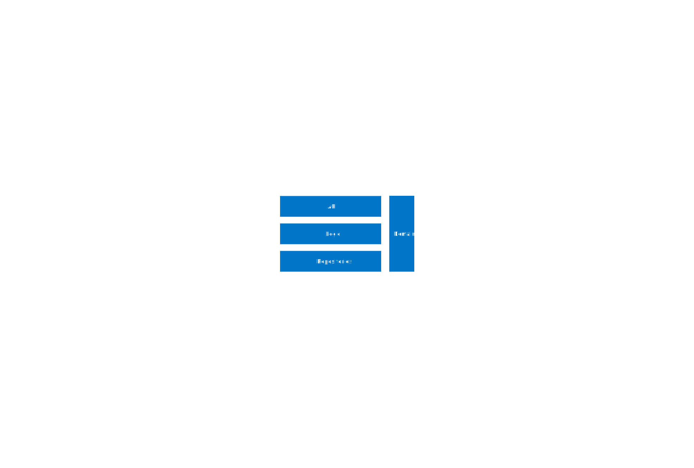

# units

is an architecture for (micro) services that focuses on

- small, easy to test, single responsibility principle conform units across all layers
- reducing dependencies between units
- including domain driven design

to achieve clean code as a basis for hiqh quality software.

## Level 1 The Layers

- Domain contains domain objects according to domain driven design.
- API contains protocol abstraction, serialization and versioning.
- Repositories layer contains data providers, no matter if they query data from a database, memory, filesystem or a remote service.
- Logic contains the rest of functionality. Some examples are: authorization, validation, converters, workflows, calculations etc.  

The Domain layer is accesible to all other layers. 
The Logic and Repositories layers can only be accessed by the layer on top of them.

## Level 2 Inside A Layer

Each layer is built out of routes. 
Routes contain the workflow of one operation and call processors that complete simple tasks.
The goal is to keep the complexity in the route so that we can build stateless processors without (too many) dependencies which are easy to test.
A route can be implemented as a stand alone class or as a method of a class that groups several routes.

